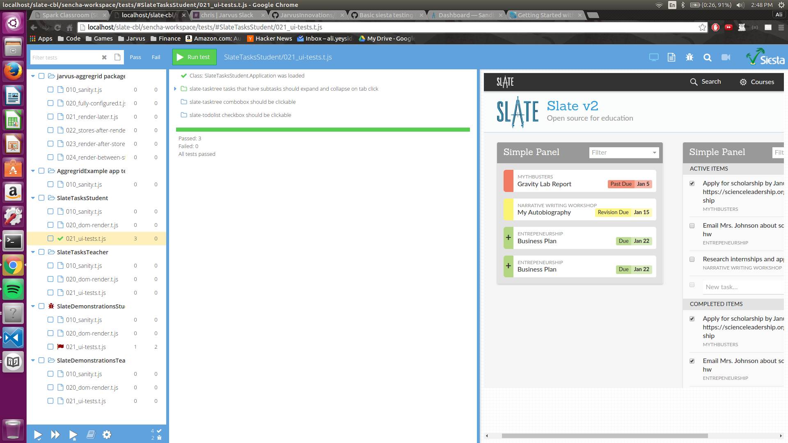

# The Jarvus Guide to Testing with Siesta

This guide will go over how to setup a Jarvus application with the Siesta lite testing framework. To get started, please note that the Siesta harness requires ExtJS version 6.0.1 or higher. This is just a requirement of the siesta harness, though you can use any version of ExtJS when running the application itself. Also, you'll need a virtual host to serve the harness on localhost.

The harness is a simple html web page that is going to provide a user interface for launching our tests. Here we can run an individual test, a testing group, or even all at once. The harness will show us what passed, what failed, and where. See picture of an example below:

[http://www.bryntum.com/docs/siesta/#!/guide/siesta_getting_started](http://www.bryntum.com/docs/siesta/#!/guide/siesta_getting_started)